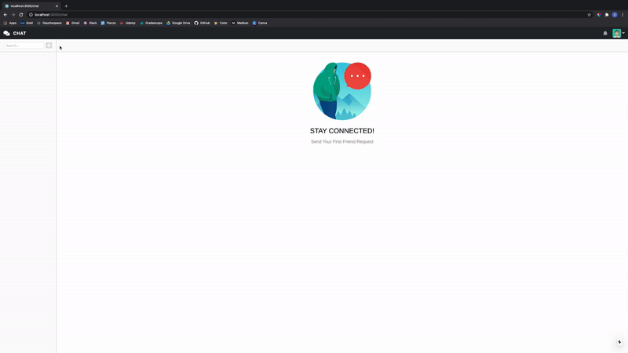
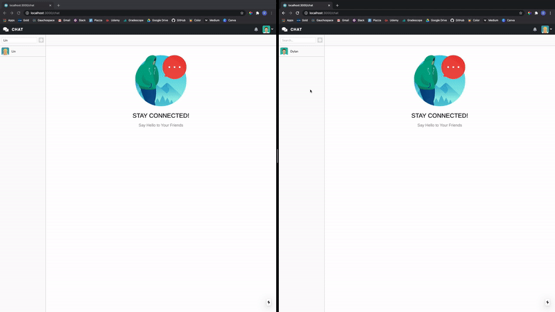

### Chat App

---

Website: https://dylan-chatapp.herokuapp.com/

<b>Examples:</b>

> Create Groups

 
 

> Friend Request

 
 

> Delete Friend

---

<b>Description:</b>

- Registered/Logged in users can create group chats so that other registered users can join
- The search bar can be used to search for a user/group and users can choose to send a friend request/join a group
- Use `socket.io` for real time communication

---

<b>Tech Stack</b>

- Use `React` library and combine with `nextjs` as the framework
- Database: MongoDB
- Client-side: HTML, CSS, Javascript (ReactJS)
- Server-side: Node.js (Express framework)
