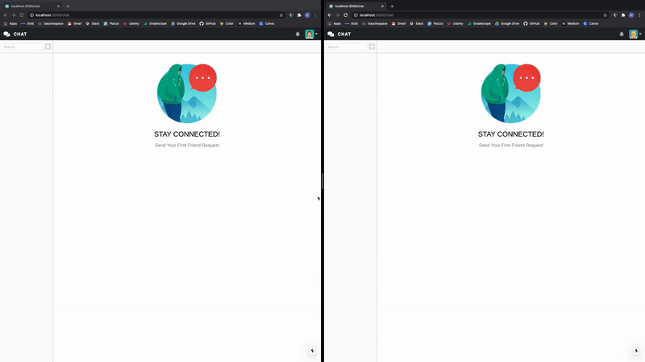

### Chat App

---

Website: https://dylan-chatapp.herokuapp.com/

<b>Examples:</b>

> Create Groups

- Users can create groups for other registered users to join and chat

 
 

> Friend Request

- Users can send friend requests to other registered users. Once the other users accept the friend requests, they can start a private chat

 
 

> Delete Friend

- Users can delete their friends. Once the users are deleted, they can receive notifications

---

<b>Description:</b>

-
